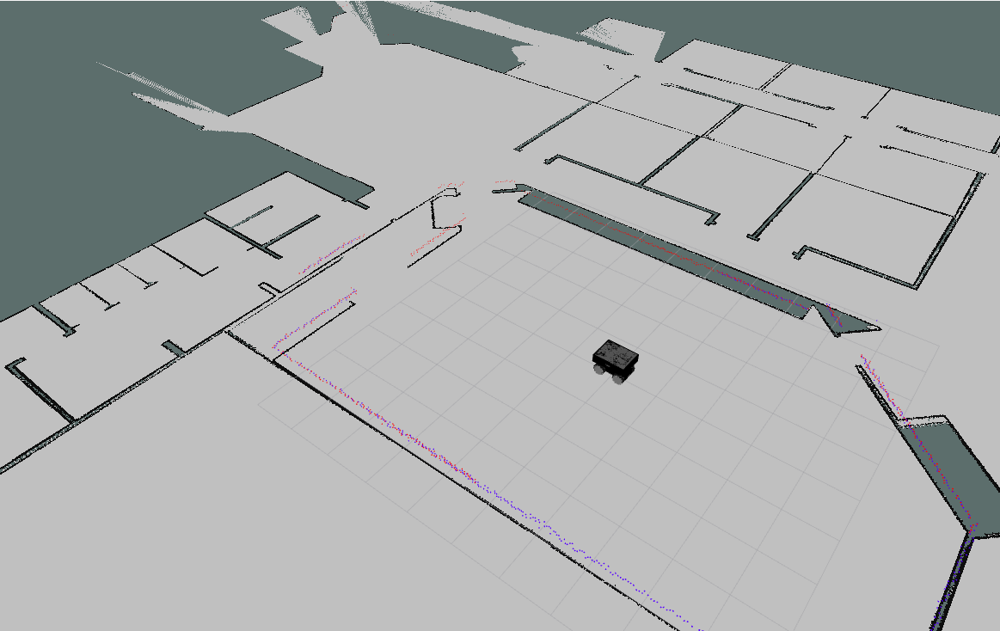
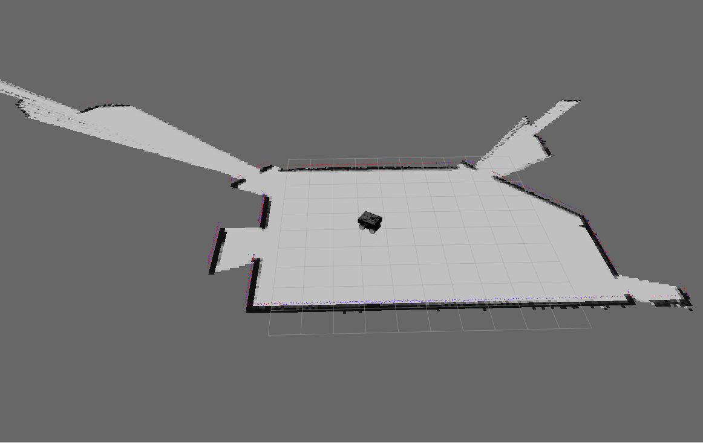
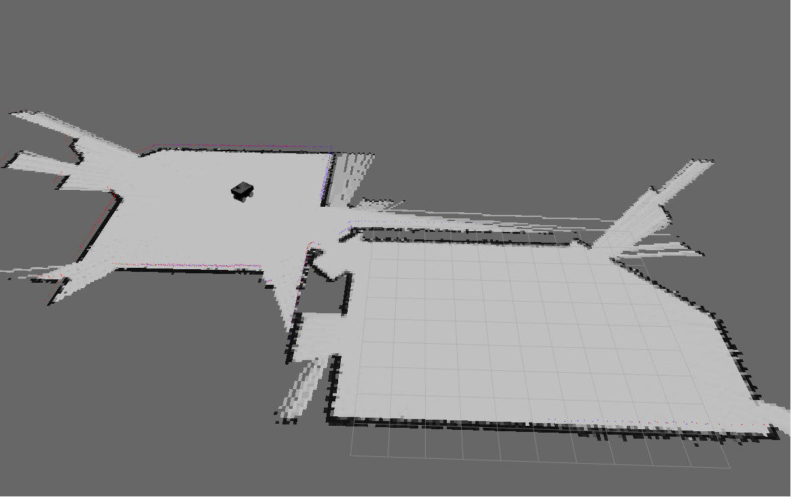

# Stupid-Robotics
<div align="center">
   </a>
   <hr>
</div>

## 📝 Table of Contents

- [About](#about)
- [Technology](#tech)
- [Dependencies](#depend)
- [Get Started](#Install) 
- [How to Run](#run)
- [Screenshots](#Screenshots)
- [Demo](#demo)
## 📙 About <a name = "about"></a>
This project aims to apply the concepts of cognitive robotics to implement a Mapping with known pose and Simultaneous Localization and Mapping(**SLAM**) algorithm, and then apply it on Gazebo and RViz simulation tools using a real-life robot model in a realistic environment from scratch.</br>
This simulation is done on **SummitXL** robot in Willow garage which is one the most popular indoor simulation environments in Gazebo.</br>
This project is divides into four requirements:
1. Control the robot using keyboard keys.
   - control node to control the robot press W, A, S, D to move the robot and Q to exit
2. Sensor Incorporating and Alignment.
   - this to merge the two laser sensors of the robot front and rear this is done by rai_laser_tools package and also to merge with them the odometry sensor readings.
3. Mapping with known pose.
   - It's required to draw the map while knowing the robot pose you can move using the control module this is done using reflective map algorithm.
4. Simultaneous Localization and Mapping(**SLAM**).
   - It's required to draw the map without knowing the robot pose you can move using the control module also this is done using approximation and a small changes have been done on the third module.

## 💻 Technology <a name = "tech"></a>


## 🔗 Dependencies <a name = "depend"></a>
#### [summit_xl_common](http://wiki.ros.org/summit_xl_common)</br>
   - Launch files that launch the complete simulation of the robot.
#### [summit_xl_sim](http://wiki.ros.org/summit_xl_sim)</br>
   - This package contains the different controllers and launch files for the SummitXL robot, shared for real robot and simulation.
#### [robotnik_msgs](http://wiki.ros.org/robotnik_msgs)</br>
   - Contains common messages and services used by some Robotnik's packages.
#### [robotnik_sensors](http://wiki.ros.org/robotnik_sensors)</br>
   - Contains Robotnik standard sensors description.
#### [ira_laser_tools](http://wiki.ros.org/ira_laser_tools)
   - Listening to different laser scan sources and merging them in a single scan or generating virtual laser scans.

## 🏁 Get Started <a name = "install"></a>
1. Setup ROS to do that follow the steps in this link 
   - <a href="http://wiki.ros.org/noetic/Installation/Ubuntu">installation for ubuntu 20.04</a>
2. Install some dependencies for ROS :
```
sudo apt-get install ros-noetic-navigation -y
sudo apt-get install ros-noetic-gmapping -y
sudo apt-get install ros-noetic-robot-localization -y
sudo apt-get install ros-noetic-mavros-msgs -y
sudo apt-get install ros-noetic-velocity-controllers -y
sudo apt-get install ros-noetic-twist-mux -y
sudo apt-get install ros-noetic-teleop-twist-keyboard -y
```
3. Clone the repo :
```
https://github.com/Ahmed-Emad10/Stupid-Robotics.git
```
4. Clone the dependencies in this directory /Stupid-Robotics/src :
```
git clone https://github.com/RobotnikAutomation/summit_xl_common.git
git clone https://github.com/RobotnikAutomation/summit_xl_sim.git
git clone https://github.com/RobotnikAutomation/robotnik_msgs.git
git clone https://github.com/RobotnikAutomation/robotnik_sensors.git
```
5. In Stupid-Robotics open a terminal and write :
```
catkin_make
```
6. Source ROS :
```
echo "source /devel/setup.bash" >> ~/.bashrc
source ~/.bashrc
```
7. Source the project :
```
echo "source ~/Stupid-Robotics/devel/setup.bash" >> ~/.bashrc
source ~/.bashrc
```

## 💿 How to Run <a name="run"></a>
1. Launch the simulation open a new terminal :
```
roslaunch summit_xl_sim_bringup summit_xls_complete.launch
``` 
   - note: if an error occurred while launching the simulation remove the following two lines from this file *Stupid-Robotics/src/summit_xl_sim/summit_xl_gazebo/launch/summit_xl_one_robot.launch* line 104 and 105 : 
      ```
      <arg name="arm_manufacturer" value="$(arg arm_manufacturer)"/>
      <arg name="arm_model" value="$(arg arm_model)"/>
      ```

2. Control the robot using W, S, A, D and Q to quit :</br>
   *do each step in a new terminal
```
roslaunch summit_xl_sim_bringup summit_xls_complete.launch
``` 
```
rosrun project_reqs control.py
```

3. Sensor Incorporating and Alignment :</br>
   *do each step in a new terminal
```
roslaunch summit_xl_sim_bringup summit_xls_complete.launch
```
```
roslaunch ira_laser_tools laserscan_multi_merger.launch
```
```
rosrun project_reqs sensor_incorporating_and_alignment.py
```

4. Mapping with known pose :</br>
*do each step in a new terminal
```
roslaunch summit_xl_sim_bringup summit_xls_complete.launch
```
```
roslaunch ira_laser_tools laserscan_multi_merger.launch
```
```
rosrun project_reqs sensor_incorporating_and_alignment.py
```
```
rosrun project_reqs mapping.py
```
```
rosrun project_reqs control.py
```
- You should go to RViz and click on Add then add new Map /map_topic  

5. Simultaneous Localization and Mapping(**SLAM**) :</br>
*do each step in a new terminal
```
roslaunch summit_xl_sim_bringup summit_xls_complete.launch
```
```
roslaunch ira_laser_tools laserscan_multi_merger.launch
```
```
rosrun project_reqs sensor_incorporating_and_alignment.py
```
```
rosrun project_reqs slam.py
```
```
rosrun project_reqs control.py
```
- You should go to RViz and click on Add then add new Map /slam_topic 

## 📷 Screenshots <a name="Screenshots"></a>
<div align="center">
Environment

Mapping

SLAM

</div>

## 📷 Demo <a name="demo"></a>


https://user-images.githubusercontent.com/65132004/210863735-0829c816-e8fb-4b8a-90f0-2cc4b0c73581.mp4

